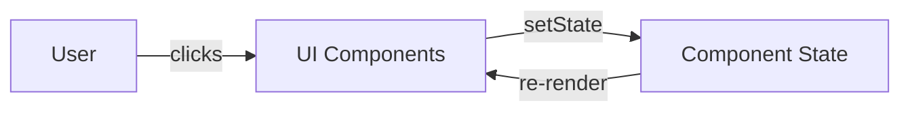

# Project Notes

## Setup

``` bash
npm install
npm run dev
```

### `npm install`

- Reads **package.json**
- Downloads all required libraries (React, Vite, etc.)
- Stores them in a folder called **node_modules**

**npm** (Node Package Manager) is used to install, manage, and run JavaScript packages.

- npm installs locally by default → only this project uses it
- npm can: install libraries, manage project dependencies, run project scripts, handle versions safely
- Similar to Linux `apt` command

**Key difference:**
- `apt` manages your machine
- `npm` manages your project

---

### `npm run dev` — **Run this every session**

**What it does:**
- Starts the development server
- Compiles your React code
- Watches for file changes (**hot reload**)
- Serves the app in the browser

```
VITE v4.4.9  ready in 676 ms

➜  Local:   http://localhost:5173/
➜  Network: use --host to expose
➜  press h to show help
```

---

## What is `import { useState } from "react";`?

`useState` is a **React hook** that lets you store and update data in your component.

**Simple explanation:** `useState` = memory

> "Hey React, remember this value for me."

**Used for:**
- Counters
- Form inputs
- Toggles
- UI state

---

## Named Import vs Default Import

| Type | Syntax | Meaning |
|------|--------|---------|  
| **Default import** | `import Component from "./file"` | File gives you one thing → it's a **box** |
| **Named import** | `import { Component } from "./file"` | File has several items → it's a **drawer to choose from** |


---

# Whats going on here? - blank dice in between rolls

  const rollDice = () => {
    setDice("dice-empty.png");
  }

“Clear the dice → wait → show new value”

You click the dice

The browser: 

sees the click
runs rollDice()
changes the image to empty dice
repaints the screen → you see the empty dice
Waits 1 second
picks a random dice image
changes the image again
repaints the screen → you see the new number


# Who stores what?
 const [dice, setDice] = useState(diceImages[0]);

 Read it as:

“I have a box called dice.
You’re not allowed to open the box directly.
To change what’s inside, you send a message through setDice. Think of setDice as a Mailbox allowed to pass messages into the inside of box. ”


**message → setDice (mailbox) → dice (box)**


Break it into two parts:

1️⃣ diceImages[randomIndex]

This immediately evaluates to a string
Example result:

"dice4.png"


Nothing is stored yet. This is just a value.

2️⃣ setDice( "dice4.png" )

This means:

“React, please put "dice4.png" into the dice box.”

After React re-renders:

dice === "dice4.png"

---

### Important distinction (this is the key)

| Thing | What it is |
|-------|------------|
| `dice` | The current stored value ← **MEMORY is here** |
| `setDice` | The only allowed way to change `dice` ← **The value is placed in the MAILBOX for `dice`** |


**You never assign directly:**
```jsx
dice = "dice4.png" // ❌ forbidden
```

**You must ask React:**
```jsx
setDice("dice4.png") // ✅
```

---

## Data Workflow Diagram




